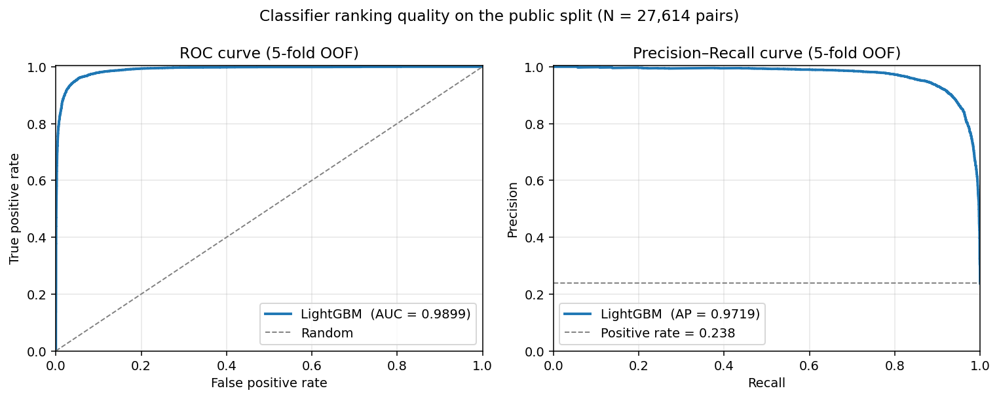
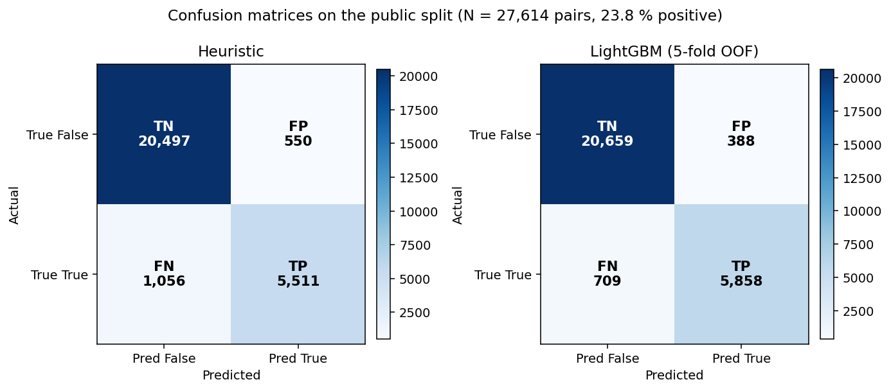
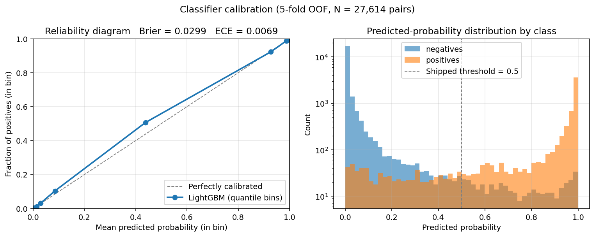

<!---
title: Relevant Priors Classifier
emoji: 🩻
colorFrom: indigo
colorTo: gray
sdk: docker
app_port: 7860
pinned: false
--->

[](https://github.com/wothmag07/relevant-priors-ml/actions/workflows/ci.yml)
[](https://www.python.org/downloads/release/python-3110/)
[](LICENSE)

<!-- markdownlint-disable-next-line MD025 -->
# Relevant Priors Classifier

Radiology relevant-priors classifier — given a current exam, decide which of a
patient's previous exams the radiologist should see. FastAPI service backed by
a LightGBM model over engineered features; deployed on Hugging Face Spaces.

## Overview

HTTP API for the **relevant-priors-v1** challenge. For each (current examination,
prior examination) pair the service predicts whether the prior should be shown
to the radiologist.

**Live endpoint:** <https://wothmag07-new-latern-space.hf.space/predict>
(`GET /healthz` returns liveness; `POST /predict` is the contract endpoint).

## Results

Public split: **27,614 labelled pairs across 996 cases**, with 23.8 % positive
class rate (6,567 relevant / 21,047 not). Because the dataset is imbalanced,
F1 and recall are the meaningful headline metrics — accuracy alone is misleading
on a 76/24 split.

| Predictor | Accuracy | Precision | Recall | F1 | Specificity |
| --- | ---: | ---: | ---: | ---: | ---: |
| Always-False baseline | 0.7622 | — | 0.000 | 0.000 | 1.000 |
| Heuristic only | 0.9418 | 0.909 | 0.839 | 0.873 | 0.974 |
| **LightGBM classifier (5-fold OOF)** | **0.9603** | **0.938** | **0.892** | **0.914** | **0.982** |
| LightGBM classifier (private split) | 0.9361 | — | — | — | — |

All public-split numbers are computed from the OOF confusion matrix produced by
`python -m eval.train_classifier` (5-fold GroupKFold,
groups = unique `(curr_desc, prior_desc)` text pair, deterministic with
`seed=42`). The private-split row is the reviewer's evaluation result on the
hidden split — only the accuracy was reported back.

**+1.85 pp accuracy and +4.1 pp F1 over a strong heuristic baseline**, with
both precision and recall improving simultaneously (the classifier finds 347
more true positives while making 162 fewer false-positive calls). Inference is
deterministic, ~2 ms/pair, and runs without any external API calls. See
[`experiments.md`](experiments.md) for the full ablation table, threshold
sweep, and embedding-baseline comparisons.

### Ranking quality

Beyond the threshold-dependent metrics above, the classifier's underlying
ranking is near-perfect: **ROC-AUC = 0.9899** and **PR-AUC = 0.9719** on the
5-fold OOF predictions (positive-rate baseline = 0.238). That means most of
the residual error is concentrated near the decision boundary — there is
little headroom from picking a better threshold (the OOF threshold sweep
peaks at acc 0.9611 around 0.40–0.45 vs 0.9603 at the shipped 0.50).





### Calibration

The classifier outputs near-calibrated probabilities — **Brier = 0.0299** and
**ECE = 0.0069** (15-bin Expected Calibration Error, ~0.7 %). The reliability
curve sits essentially on the diagonal and the predicted-probability
distribution is strongly bimodal, with most pairs landing near 0 or 1. That's
the structural reason the threshold sweep barely moved the OOF accuracy
(0.9603 @ 0.50 vs 0.9611 @ 0.45) — almost no mass lives near the decision
boundary, so where the cut is set is nearly irrelevant.



All three figures are regenerated by `python -m eval.plot_metrics`.

### Where the classifier helps most

Per-current-modality breakdown of OOF F1 (full table at
[`docs/slice_analysis.md`](docs/slice_analysis.md), regenerated by
`python -m eval.slice_analysis`):

| Curr modality | N | Heur F1 | CLF F1 | Δ F1 |
| --- | ---: | ---: | ---: | ---: |
| `ct` | 6,975 | 0.900 | 0.917 | +0.017 |
| `xr` | 5,866 | 0.907 | 0.932 | +0.025 |
| `mammo` | 4,249 | 0.933 | 0.975 | +0.041 |
| `mri` | 3,814 | 0.833 | 0.869 | +0.036 |
| `us` | 3,186 | 0.717 | 0.839 | **+0.122** |
| `cta` | 1,241 | 0.712 | 0.826 | **+0.115** |
| `dxa` | 618 | 0.976 | 0.964 | −0.012 |
| `fluoro` | 264 | 0.327 | 0.536 | **+0.209** |
| `eeg` | 77 | 0.136 | 0.750 | **+0.614** |

The lift is wildly non-uniform. The classifier delivers most of its value on
the modalities where the heuristic is weakest (`us`, `cta`, `fluoro`, `eeg`)
and modestly improves the modalities where the heuristic is already
near-saturated (`ct`, `xr`, `mammo`). The single negative delta is `dxa`
(−0.012), where the heuristic's exclusive-region rule already hits F1 = 0.976;
the classifier marginally overfits on the small support (618 pairs). That's
the honest cost of letting the data drive the rules.

## API

```http
POST /predict
Content-Type: application/json
```

Request and response shapes match the challenge brief verbatim — see
[`app/schemas.py`](app/schemas.py).

`POST /` is also accepted (some evaluators target the root path). `GET /healthz`
returns liveness + classifier-availability status.

### Try it against the live endpoint

```bash
curl -sS -X POST https://wothmag07-new-latern-space.hf.space/predict \
  -H 'Content-Type: application/json' \
  -d '{
    "challenge_id": "relevant-priors-v1",
    "schema_version": 1,
    "generated_at": "2026-05-13T12:00:00.000Z",
    "cases": [{
      "case_id": "demo-1",
      "patient_id": "p-1",
      "patient_name": "Demo, Patient",
      "current_study": {
        "study_id": "curr-1",
        "study_description": "MRI BRAIN STROKE LIMITED WITHOUT CONTRAST",
        "study_date": "2026-03-08"
      },
      "prior_studies": [
        {"study_id": "p-a", "study_description": "MRI BRAIN WITHOUT CONTRAST", "study_date": "2020-03-08"},
        {"study_id": "p-b", "study_description": "CT HEAD WITHOUT CONTRAST",   "study_date": "2021-03-08"},
        {"study_id": "p-c", "study_description": "KNEE, LEFT - 2 VIEWS",       "study_date": "2019-01-01"}
      ]
    }]
  }'
```

Expected response (one prediction per prior, same `case_id`/`study_id` as the
request):

```json
{
  "predictions": [
    {"case_id": "demo-1", "study_id": "p-a", "predicted_is_relevant": true},
    {"case_id": "demo-1", "study_id": "p-b", "predicted_is_relevant": true},
    {"case_id": "demo-1", "study_id": "p-c", "predicted_is_relevant": false}
  ]
}
```

## Approach

Three layered tiers — no external API at inference time.

1. **LightGBM classifier** ([`app/classifier_model.py`](app/classifier_model.py),
   [`app/features.py`](app/features.py)) — primary path. Trained offline on the
   public split with ~120 engineered features per pair: region one-hots,
   modality, contrast, laterality, date deltas, description-text features, and
   the heuristic's own prediction + confidence as inputs. Deterministic,
   ~2 ms/pair, packaged in the image.
2. **Heuristic-only fallback** — fires if `classifier_model.pkl` is missing
   on a deploy or if a feature-schema-drift check at load time refuses the
   model. [`app/parser.py`](app/parser.py) tags each `study_description` with
   anatomical regions + modality + contrast/laterality;
   [`app/heuristic.py`](app/heuristic.py) does region-set overlap with
   confidence scoring.
3. **All-False fallback** — handled at the FastAPI layer in
   [`app/main.py`](app/main.py). If both tiers above fail or the request
   exceeds a 300 s wall-clock budget, one all-False prediction per prior is
   returned (76 % baseline). No prediction is ever skipped.

## Pipeline

Two phases that share the same feature-engineering code in `app/features.py`,
which guarantees train/inference parity (no skew).

### Training (offline, run once via `python -m eval.train_classifier --save`)

```text
relevant_priors_public.json (27,614 labeled pairs)
        │
        ▼
load_pairs()  →  list of {curr_desc, prior_desc, curr_date, prior_date, label}
        │
        ▼
For each pair: featurize(...)
       │   parse_description(curr_desc) → StudyTags(regions, modality, ...)
       │   parse_description(prior_desc) → StudyTags(...)
       │   classify_pair(curr_tags, prior_tags) → HeuristicResult (used as features)
       ▼
   ~120 numeric features per pair
        │
        ▼
X (27614 × 121),  y (27614,)
        │
        ▼
GroupKFold (groups = unique curr+prior text pair) → honest 5-fold CV (0.9603 OOF)
        │
        ▼
lgb.train(full_data) → app/classifier_model.pkl    (1 MB pickle, packaged in image)
```

### Inference (online, every `POST /predict` request)

```text
POST /predict {cases: [...]}
        │
        ▼
app/main.py::_handle      ← wraps in 300 s wall-clock budget (asyncio.wait_for)
        │
        ▼
app/classifier.py::predict_cases_async
        │
        ▼
┌──────────────────────────────────┐
│ Tier 1: LightGBM                 │ ← fires if classifier_model.pkl is present
│   _predict_via_classifier        │   AND its feature schema matches features.py
│   → featurize each pair          │   (the production path)
│   → model.predict(X)             │
│   → bool[i] = proba[i] >= 0.5    │
└──────────┬───────────────────────┘
           │ model missing or schema drift? ↓
┌──────────▼───────────────────────┐
│ Tier 2: heuristic only           │ ← defensive fallback
│   parser → classify_pair()       │   (no API, fully self-contained)
│   → bool from HeuristicResult    │
└──────────┬───────────────────────┘
           │ tier 2 raises or budget expires? ↓
┌──────────▼───────────────────────┐
│ Tier 3: all-False                │ ← ultimate safety net at FastAPI layer
│   one False per prior            │   (returns 76 % baseline, never skips)
└──────────────────────────────────┘
        │
        ▼
HTTP 200 {predictions: [{case_id, study_id, predicted_is_relevant}, ...]}
```

### File responsibilities

| File | Responsibility | Used in training | Used in inference |
| --- | --- | :---: | :---: |
| [`app/parser.py`](app/parser.py) | text → `StudyTags(regions, modality, contrast, laterality)` | ✓ | ✓ |
| [`app/heuristic.py`](app/heuristic.py) | `(StudyTags, StudyTags) → HeuristicResult` (predicted, confidence, reason) | ✓ | ✓ |
| [`app/features.py`](app/features.py) | `(curr, prior, dates, tags) → 121-dim numeric vector` | ✓ | ✓ |
| [`eval/train_classifier.py`](eval/train_classifier.py) | Build X/y, GroupKFold CV, train final, save pickle | ✓ | — |
| `app/classifier_model.pkl` | Pickled `{model, feature_names, threshold}` | output | input |
| [`app/classifier_model.py`](app/classifier_model.py) | Lazy-load pickle; `predict_batch(pairs) → list[bool]` | — | ✓ |
| [`app/classifier.py`](app/classifier.py) | Tier-routing: classifier → heuristic | — | ✓ |
| [`app/main.py`](app/main.py) | FastAPI endpoint + 300 s wall-clock budget | — | ✓ |

### What "the model" actually is

A LightGBM gradient-boosted tree (300 boosted trees, ~1 MB pickled), trained
on engineered features. It is **not** a Hugging Face Hub model — HF Spaces is
just the Docker host. The pickle ships inside the image at
`app/classifier_model.pkl` and is loaded lazily on the first request. The
inference path has no external API dependency.

Top features by gain (LightGBM, measured on the last CV fold):

| Rank | Feature | What it captures |
| --- | --- | --- |
| 1 | `heur_pred` | The heuristic's prediction itself — dominant input |
| 2 | `expanded_overlap` | Region overlap with coverage expansions (e.g. `abd_pel ⊇ {abdomen,pelvis}`) |
| 3 | `date_delta_days` | Days between current and prior study (signal the heuristic ignored) |
| 4 | `heur_conf` | Heuristic confidence as a second-order signal |
| 5 | `lateral_mismatch` | Left↔right detection (parsed but never used by heuristic) |
| 6 | `direct_overlap` | Literal region-set intersection |
| 7 | `shared_tokens` | Token-level text similarity |
| 8 | `desc_len_ratio` | Length ratio of the two descriptions |

The classifier essentially **augments** the heuristic with date deltas,
laterality, and text-level similarity — three signals the heuristic doesn't
look at. That's where the +1.85 pp jump from heuristic (0.9418) to classifier
OOF (0.9603) comes from.

## Worked example — how one prediction is made

[`docs/walkthrough.py`](docs/walkthrough.py) takes a single (current, prior)
pair through the entire pipeline (parser → heuristic → featurizer → classifier)
and uses LightGBM's `pred_contrib=True` to break down the *per-feature
log-odds contribution* for that one prediction. It's runnable as a script
(`python docs/walkthrough.py`) or convertible to a notebook with
`jupytext --to ipynb docs/walkthrough.py`.

Useful for understanding *why* the classifier predicts what it does, not just
what it predicts.

## Engineering decisions

Choices that aren't obvious from the code, with the reasoning behind each:

- **GroupKFold over plain KFold for cross-validation.** The dataset has many
  cases that share `(curr_description, prior_description)` text pairs. A naive
  KFold leaks identical text across folds and inflates accuracy. Grouping by
  the unique text pair gives an honest out-of-sample estimate (0.9603 OOF →
  0.9361 on the truly held-out private split, a realistic 2.4 pp generalisation
  gap rather than the >5 pp gap the leaky split was hiding).
- **Heuristic outputs are fed into the classifier as features**, not chained
  in series. `heur_pred` is the single highest-gain feature. Training the GBM
  on top of the heuristic lets it *correct* the heuristic on the long tail
  (date deltas, laterality, text similarity) instead of replacing it. The
  +1.85 pp lift comes entirely from those three signals the heuristic ignores.
- **3-tier graceful degradation, never skip a prediction.** Skipping a prior
  scores worse than guessing (the always-False baseline is 76.2%, not 50%),
  so the FastAPI handler in [`app/main.py`](app/main.py) wraps the whole
  request in a 300 s wall-clock budget (well inside the 360 s evaluator
  timeout) and falls back: classifier → heuristic-only → all-False. Every
  prior in the request gets exactly one prediction with the matching IDs,
  no matter what.
- **Schema-drift guard on the pickled model.** `app/classifier_model.py`
  validates that the feature names baked into the pickle match what
  `app/features.py` produces *now*. If they diverge (e.g. a feature was
  renamed after the model was trained) the model is refused at load time
  and the heuristic fallback fires instead — a silent prediction-quality
  regression is worse than a visible fallback.
- **Tuned by data, not domain intuition.** Several "obviously right" rules
  (heart↔chest, brain↔sinuses, OUTSIDE FILMS → relevant) are net-negative
  on the public split and were intentionally removed. `OUTSIDE FILMS`
  defaults to `False` because the public truth is unanimous (0/67 positive).
  Every rule in [`app/parser.py`](app/parser.py) was kept or dropped based
  on a `(positive, negative)` count in the labels — see
  [`experiments.md`](experiments.md) for the ablation log.
- **Dropped the LLM tier.** An earlier version routed low-confidence pairs
  to `gpt-4o-mini`. After measuring, the LightGBM tier matched it on
  accuracy without the 200–800 ms/pair latency, the per-request token
  budget, or the API-key dependency. Removing it made the inference path
  fully self-contained and deterministic.

## Local development

```bash
# uv-based setup (recommended)
uv venv --python 3.11
source .venv/Scripts/activate          # Windows; on macOS/Linux: source .venv/bin/activate
uv pip install -r requirements-dev.txt         # includes prod deps + pytest, ruff, mypy, matplotlib

pre-commit install                              # one-time: enable git hooks (ruff, mypy, plot-staleness check)

# Common tasks (see `make help` for the full list):
make test                                       # contract + parser unit tests
make check                                      # ruff + mypy + tests (matches CI)
make eval                                       # score the classifier on the public split
make train                                      # 5-fold CV (deterministic with seed=42)
make train-save                                 # retrain on full data, save app/classifier_model.pkl
make plots                                      # regenerate docs/confusion.png + docs/roc_pr.png
make serve                                      # dev server on :8000

# Underlying commands (use these on Windows without `make`):
pytest tests/ -q
ruff check . && mypy app eval
python -m eval.run_eval --predictor classifier
python -m eval.train_classifier --save
python -m eval.plot_metrics
uvicorn app.main:app --reload
```

## Deployment (Hugging Face Spaces)

1. Create a new Space → SDK = Docker.
2. Push this repo. The Dockerfile builds a Python 3.11 image, installs
   `requirements.txt`, and copies `app/` (including the trained
   `classifier_model.pkl`).
3. The `app_port: 7860` in the metadata tells HF where to send traffic.
4. No secrets required — the inference path is fully self-contained.

## Environment variables

| Var | Default | Notes |
| --- | --- | --- |
| `CLASSIFIER_MODEL_PATH` | `app/classifier_model.pkl` | Override path to the trained LightGBM model. |
| `CLASSIFIER_THRESHOLD` | `0.5` (or value baked into the pkl) | Probability threshold for the classifier. |
| `REQUEST_TIMEOUT_S` | `300` | Hard wall-clock budget per `/predict` request. On expiry, in-flight tasks are cancelled and the all-False fallback fires (well inside the evaluator's 360 s timeout). |
| `LOG_LEVEL` | `INFO` | Standard Python logging level. |
